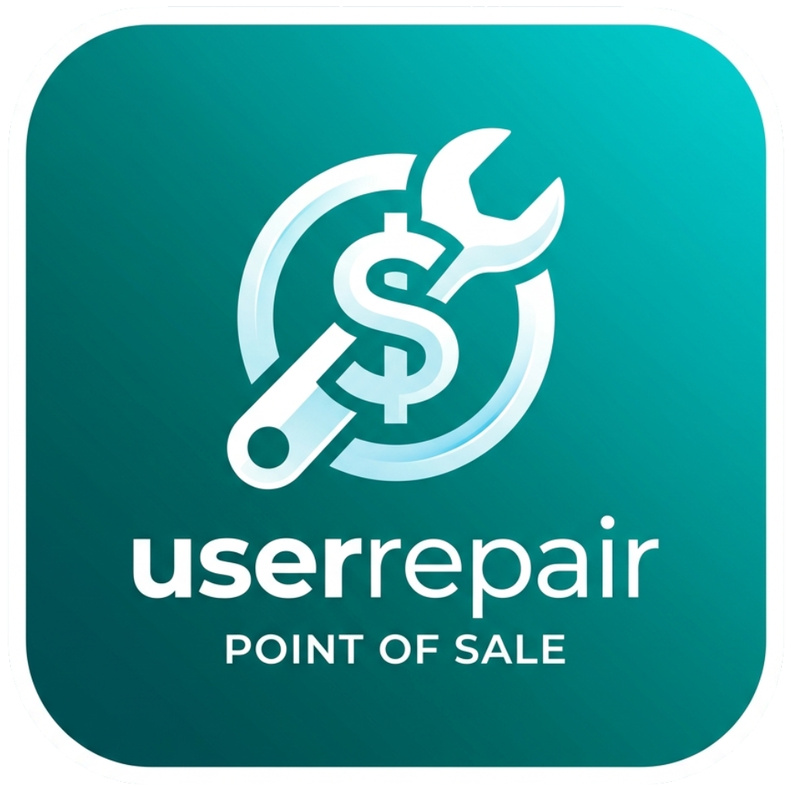
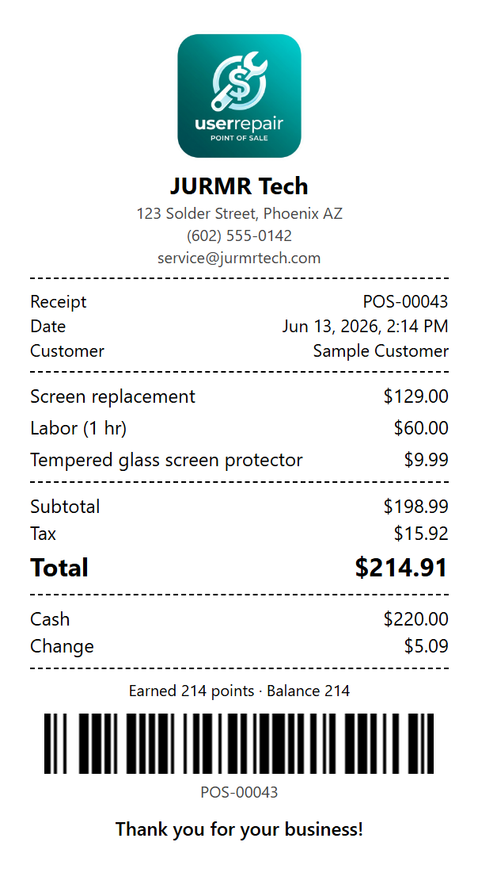

<div align="center">



# userrepair

**The offline-first point of sale and shop manager built for board-level electronics repair.**

Repair tickets - inventory with barcodes - live microscope camera - point of sale - rewards - multi-PC, all on the shop's own machine.


</div>

---

## Contents

- [Why userrepair](#why-userrepair)
- [Features](#features)
- [Requirements](#requirements)
- [Install and run](#install-and-run)
- [First-run setup](#first-run-setup)
- [Roles](#roles)
- [Payments, rewards, and configuration](#payments-rewards-and-configuration)
- [Hardware: receipt printers, scanners, card readers](#hardware-receipt-printers-scanners-card-readers)
- [Running on multiple computers](#running-on-multiple-computers)
- [Ringing out a repair ticket](#ringing-out-a-repair-ticket)
- [Data, backup, and restore](#data-backup-and-restore)
- [For developers](#for-developers)

---

## Why userrepair

userrepair runs **entirely on the shop's own computer** with a local SQLite database.
There is no account to sign up for and no cloud to depend on. The only feature that
touches the internet is taking card payments through Square, which you enable and
configure yourself. Everything else, including a built-in catalog of thousands of real
parts and hundreds of device board revisions, works with no connection at all.

Built with **Tauri 2 (Rust)** + **React + TypeScript**.

---

## Features

### 🧾 Point of sale

| | |
|---|---|
| **Tenders** | Cash (with change due), keyed card and Square Terminal, redeem points, or any **split** across them |
| **Ring out tickets** | Look up an open repair by customer phone or name and pull its parts and labor into the cart |
| **Barcode scanner** | Any generic USB scanner adds items to the cart instantly |
| **Card field** | A Square-powered keyed card field, styled to match the app, plus Square Reader / Terminal for swipe / tap / chip |
| **Receipt printer** | Generates a clean local receipt for any USB / thermal printer, in 58mm or 80mm |
| **Refunds / voids** | Reverse a sale (refunds card tenders via Square, restores stock); manager approval above a set amount |
| **Receipts** | On-screen breakdown, change given, points earned, a printable receipt, and a link to the Square receipt |

### 🔧 Repair shop

| Area | What you get |
|---|---|
| **Tickets** | Drag-and-drop board, full status flow, timeline, notes, parts that deduct stock, labor by the hour, **edit locks** so two PCs never clash on the same ticket, and a **photos & captures** gallery |
| **Customers** | Profiles, device + repair history, lifetime value, duplicate detection, tags, rewards balance |
| **Devices** | Brand / model / model-number, IMEI check, per-model repair history |
| **Inbox** | A Manager-only two-pane inbox of customer text replies, matched to their profile, with one-click reply by real text |
| **Inventory** | Locations, suppliers, low-stock alerts, audit log, **in-place editing**, **duplicate an item**, and a **printable barcode label** per item |
| **Microscope** | Live USB microscope feed with zoom, **drag-to-pan**, mirror / flip, fullscreen, **pop-out** to another monitor, and **photo / video capture** saved to a folder (sent to the main PC on a LAN) |
| **Board tools** | Board-level **measurements** and known-good values, test-point / net / component indices, and **attach / open a boardview file** per revision (your own licensed files or free open-hardware designs) |

### 📚 Built in, offline

- **Parts reference**: ~3,900 real parts, ICs, microcontrollers, and single-board computers, searchable.
- **Board revisions**: 300+ devices (phones, tablets, consoles) with component references.
- **Knowledge base**: rich-text articles with wiki links, backlinks, and version history.

### 🎁 Business

- **Rewards program**: earn points per dollar, redeem as a discount, configurable rates, full ledger.
- **Accounts and roles**: owner, manager, technician, clerk, with Argon2-hashed passwords.
- **Financial**: revenue / expense, P&L, invoices. **Reporting** shows inventory value and inventory sale total (with the margin between), throughput, and most-failed components, all with CSV export.
- **Multi-PC**: run it on several computers in the shop, all sharing one machine's data over the LAN, with **live refresh** and **automatic reconnect**.
- **In-app updates**: a top-bar button checks for a new version on launch and on demand, shows a dot when one is ready, and installs it silently when you choose to. No auto-update.
- **Customer notifications**: email customers a polished status update (with a repair-progress stepper) as their repair moves forward, through your own SMTP provider, plus **real text messages** via Pingram (with free email-to-SMS as a backup) for customers whose preferred contact is SMS. A **Manager Inbox** shows their replies so you can text back. Queued and retried if the internet is down.
- **Extras**: global search (`Ctrl+K`), backup and restore, your own logo, dark mode, plugin foundation.

---

## Requirements

| | |
|---|---|
| **OS** | Windows 10 / 11 (WebView2 is preinstalled on 11; install it on 10 if missing) |
| **Node.js** | 18 or newer, with npm |
| **Rust** | stable, via [rustup](https://rustup.rs/) |
| **Build tools** | Microsoft C++ Build Tools (Desktop development with C++) |

Full Tauri prerequisites: <https://v2.tauri.app/start/prerequisites/>

---

## Install and run

```bash
npm install        # restore dependencies
npm run tauri:dev  # run the app with hot reload
```

The first launch opens the **setup wizard**.

### Build an installer

```bat
build.bat
```

This builds and drops the **standalone .exe** plus the **NSIS and MSI installers**
into a `Software/` folder. (Or run `npm run tauri:build` directly.)

---

## First-run setup

A fresh install has no accounts, so the **setup wizard** runs first and asks for:

1. **Business name** (and optional phone / email)
2. An optional **shop logo** (shown in the app; does **not** change the application icon)
3. The **owner account**: your name, a username, and a password

Finish, and you are signed straight in as the owner. Closing the app signs you out, so
the next person signs in fresh.

---

## Roles

| Role | Access |
|---|---|
| **Owner / Manager** | Everything |
| **Technician** | Tickets, customers, devices, stock, bench tools, knowledge |
| **Clerk** | Point of sale, sales history, knowledge, stock |

Create accounts under **Settings → Staff** (owner / manager only).

---

## Payments, rewards, and configuration

Everything is under **Settings**:

- **General** - business info (your **shop name** appears in the sidebar), **logo upload**, tax rate, labor hourly rate.
- **Payments (Square)** - enable Square, environment, Application ID, Access Token, Location ID,
  optional Terminal device id, and **Save & test connection**. Card data is tokenized in the
  app; the charge is made from the Rust backend so your **access token never leaves the machine**.
  Includes a manual refund tool. Refunds over a set amount require manager approval.
- **Receipt** - choose 58mm or 80mm paper, set a footer message, and print a test receipt.
- **Rewards** - turn the program on and set points-per-dollar and redemption value.
- **Notifications** - email customers on status changes via your own SMTP (Gmail works with an app password); choose which statuses notify and send a test. **Text messages** go out via **Pingram** (real carrier SMS, it handles A2P 10DLC) to customers whose preferred contact is SMS, with a free **email-to-SMS** fallback. Replies arrive in the **Inbox** (Manager+) when you point Pingram's inbound webhook at your main PC (see [Receiving text replies](#receiving-text-replies-cloudflare-tunnel)).
- **Network** - see this PC's role (standalone / main / client) and connection details.
- **Bench** - set the folder where microscope photos and recordings are saved (on a multi-PC setup, every PC's captures are sent to this folder on the main PC).
- **Staff** - create accounts, reset passwords, deactivate.

---

## Hardware: receipt printers, scanners, card payments

userrepair is built for off-the-shelf USB hardware. Nothing proprietary is required.

| Device | How it works |
|---|---|
| **Receipt printer** | Any USB or thermal printer installed in Windows. userrepair builds its **own** clean receipt (logo, line items, totals, a scannable barcode of the sale number, and your footer) and prints it. Pick **58mm** or **80mm** under **Settings -> Payments -> Receipt**, and **Print test receipt** opens an in-app preview at your paper width to print or **save as a PNG or PDF**. |
| **Barcode scanner** | Any generic USB scanner (keyboard-wedge). Scan an item's barcode to add it to the cart; print barcode labels for inventory from the Inventory page. |
| **Card payments** | A keyed card field powered by the Square Web Payments SDK (PCI-compliant, styled to match the app), or a **Square Reader / Terminal** for swipe / tap / chip via the Terminal tender. Card numbers are encrypted by Square and never touch this app. |
| **USB microscope / webcam** | Any UVC camera. The Microscope tab shows a live feed with zoom, pan, mirror, flip, fullscreen, and pop-out, and captures photos and clips to a folder. Capture from the bench and upload the result to a ticket. |

> **Note on card readers:** for PCI compliance, card-present swipe / tap / chip goes through Square's own encrypted **Reader** or **Terminal** (the Terminal tender). A generic magstripe reader is not used, because the magnetic stripe does not carry the CVV and Square's card field is a secure cross-origin element that cannot be auto-filled.

### Example receipt

<div align="center">



<sub>An 80mm receipt generated and printed by userrepair (logo, line items, totals, change, points, and a scannable barcode of the sale number).</sub>

</div>

---

## Running on multiple computers

Have more than one PC in the shop? One computer holds the data and the others connect to it, so tickets, inventory, sales, and accounts are shared live.

On the **first launch**, each PC asks how it should run:

| Choice | Use it on |
|---|---|
| **Just this PC** | A single-computer shop (you can add PCs later). |
| **This is the main PC** | The owner's computer. It holds the database and serves the others. It shows an address like `http://192.168.1.50:8787` and an optional access key. |
| **Connect to the main PC** | Every other computer. Enter the main PC's address and key, and it joins instantly. |

A few things to know:

- All PCs must be on the **same local network**. No internet or cloud is involved.
- Keep the **main PC on and signed in** during business hours, since it holds the data.
- The first time the main PC starts serving, **Windows may ask to allow it on your network** - choose Allow.
- Set an **access key** on the main PC so only your computers can connect.
- **Microscope captures** taken on any PC are sent to the capture folder on the **main PC**, so set that folder (Settings -> Bench) to a path that exists on the main PC.
- You can review or change any PC's role later under **Settings -> Network**.

---

## Setting up text messages (Pingram)

Real carrier texts go out through [Pingram](https://www.pingram.io). One API key is all userrepair needs - there is no Client ID, Client Secret, or Notification ID.

1. Create a Pingram account and add an SMS sender (Pingram handles the A2P 10DLC carrier registration for you).
2. Create a **notification** named `repair_status_update` and enable its **SMS** channel. userrepair sends the message text inline, so the template body can be left as-is.
3. Open the **Environments** section of the Pingram dashboard and copy the **API key** (it looks like `pingram_sk_...`).
4. In userrepair, go to **Settings -> Notifications -> Text messages**, turn on "Text customers via Pingram", and paste:
   - **API key** - the `pingram_sk_...` key
   - **Notification type** - `repair_status_update` (or whatever you named it)
5. Click **Send test (Pingram)** to confirm a text arrives.

Customers are only texted when their **preferred contact** is set to SMS. When a customer texts back, Pingram auto-replies with a short "we got your message" note and the reply lands in the **Inbox** (see below).

---

## Receiving text replies (Cloudflare Tunnel)

Sending texts works on its own. To also receive **replies** in the **Inbox**, Pingram (which lives in the cloud) needs to reach your main PC, and the main PC only listens on your local network. A free **Cloudflare Tunnel** gives your main PC a public HTTPS address without opening any ports.

You only need this for the Inbox. Set it up on the **main PC** (the one running in "This is the main PC" mode).

**1. Install cloudflared**

```powershell
winget install --id Cloudflare.cloudflared
```

**2. Quick test (no account, temporary URL)**

This is the fastest way to confirm replies work. The host server runs on port `8787` by default (see Settings -> Notifications for the exact address).

```powershell
cloudflared tunnel --url http://localhost:8787
```

It prints a URL like `https://random-words.trycloudflare.com`. Your inbound webhook is that URL plus the path and token shown in **Settings -> Notifications**, for example:

```
https://random-words.trycloudflare.com/inbound/sms?token=YOUR-ACCESS-KEY
```

Paste that into Pingram (**SMS -> Inbound -> Enable SMS inbound webhook -> Save**), text your shop number, and the reply should appear in the Inbox. Note: this temporary URL changes every time you restart the command, so it is for testing.

**3. Permanent setup (stable URL, recommended)**

For a URL that survives restarts you need a free Cloudflare account with a domain added to Cloudflare:

```powershell
cloudflared tunnel login
cloudflared tunnel create userrepair
cloudflared tunnel route dns userrepair sms.yourshop.com
```

Create a config file at `%USERPROFILE%\.cloudflared\config.yml`:

```yaml
tunnel: userrepair
credentials-file: C:\Users\YOU\.cloudflared\<tunnel-id>.json
ingress:
  - hostname: sms.yourshop.com
    service: http://localhost:8787
  - service: http_status:404
```

Then run it (and install it as a service so it starts with Windows):

```powershell
cloudflared tunnel run userrepair
cloudflared service install
```

Your stable webhook becomes `https://sms.yourshop.com/inbound/sms?token=YOUR-ACCESS-KEY`. Paste that into Pingram once and you are done.

**Notes**

- Keep the **main PC and the tunnel running** during business hours so replies come in.
- The `token` is your **network access key** (Settings -> Network); it stops anyone else from posting to your inbox. The exact webhook URL is shown for you in **Settings -> Notifications**.
- This is only for inbound replies. Nothing else about the app touches the internet beyond Square, the update check, and your own email/SMS provider.

---

## Ringing out a repair ticket

```
Technician                          Clerk (Point of Sale)
-----------                         ---------------------
Open the ticket            ──▶      Search "Ring out a ticket" by phone / name
Add parts (deducts stock)           Pick the ticket → parts + labor load to cart
Add labor (hours × rate)            Take payment (cash / card / Terminal / points / split)
                                    Finish → sale records, ticket marked Completed
```

Walk-in product sales do not need a customer, and you can **add a customer on the spot** at
checkout to start earning rewards.

---

## Data, backup, and restore

- All data lives in a local SQLite database in the OS app-data folder
  (`%APPDATA%\com.userrepair.app\`), next to an `attachments/` folder.
- The built-in parts / board / knowledge catalog ships with the app.
- **Backup & Restore** exports the database and attachments as one ZIP and restores from it.

> Money is stored as integer cents, dates as UTC, and deletes are soft, so history is preserved.

---

## For developers

<details>
<summary><b>Stack, layout, scripts, and architecture</b> (click to expand)</summary>

### Stack

Tauri 2.11 (Rust) + React 18 + TypeScript (strict, no `any`) + Vite 6, Tailwind v3 with
shadcn/ui (Radix). Zustand state, TanStack Table + Virtual, React Hook Form + Zod, TipTap,
Recharts, JsBarcode, and `tauri-plugin-sql` (SQLite + FTS5). Card payments use the Square Web
Payments SDK (frontend) and the Square Payments / Refunds / Terminal APIs (Rust via reqwest).
Passwords use Argon2id.

### Scripts

| Command | What it does |
|---|---|
| `npm run tauri:dev` | Run the full app with hot reload |
| `npm run dev` | Vite only, in a browser (no native commands) |
| `npm run typecheck` | `tsc --noEmit` (strict) |
| `npm run build` | Typecheck + Vite production build |
| `npm run tauri:build` | Native release build (installers) |
| `node scripts/seed-reference.mjs` | Regenerate the parts / board / article seed SQL |
| `npx tauri icon userrepair-app-icon.png` | Expand an icon into the full set |

### Project layout

```
src/                  React + TypeScript frontend
  routes/             one page per module (POS, tickets, inventory, ...)
  components/         ui/ (shadcn), layout/, shared/, pos/, customers/
  lib/                db.ts, net.ts (LAN routing + host upload), sync.ts, camera.ts, update.ts, markdown.tsx, receipt.ts, square.ts, repos/, validators, format, roles
  components/camera/  CameraStage + CameraControls (live feed, zoom, pan, flip, fullscreen)
  stores/             Zustand (auth, theme, ui, brand, update)
  hooks/              useAsync, useBarcodeScanner, useSyncMonitor, useTicketLock
  types/              shared types (no any)
src-tauri/            Rust backend
  src/db/             migrations.rs + schema.sql + seed_*.sql
  src/commands/       db_tx, square, auth, backup, attachments, camera, update, email, pingram, system, net
  src/server.rs       embedded LAN host server (axum) for multi-PC mode (DB, /cmd, /capture, /attach, /inbound/sms)
  capabilities/       Tauri 2 ACL
scripts/              icon + catalog generators
plugins/              example plugin manifest
```

### Architecture

- CRUD runs in the frontend through a typed data layer (`src/lib/db.ts` + per-domain
  repositories in `src/lib/repos/`) on top of `tauri-plugin-sql`.
- Multi-table writes (consume part + decrement stock + audit) run through the native `db_tx`
  command so they are atomic on one connection.
- The schema is created by versioned migrations on first launch. The reference catalog is
  generated by `scripts/seed-reference.mjs` into the seed SQL files.
- Native Rust commands are limited to what the webview cannot do safely: `db_tx`, Square
  payment / refund / terminal calls, password hashing, attachment storage with hash-dedup,
  backup / restore ZIPs, shell-open for boardview / PDF files, microscope capture saving
  (`save_capture`), the update check / silent install (`check_for_update`, `install_update`),
  and the multi-PC networking commands (`net_post`, `net_post_bytes`, `start_host_server`,
  `host_lan_ip`).
- Multi-PC mode routes the entire data layer through one chokepoint: in client mode,
  `lib/db.ts` and the Square caller forward to the host's `src/server.rs` (axum) over the LAN
  instead of the local SQLite. The host serves `/db/select`, `/db/execute`, `/db/tx`, a `/cmd`
  proxy, and binary `/capture` and `/attach` endpoints (so a client's microscope photos and
  clips land in the host's folder and ticket attachments live where the shared row points),
  gated by a shared key. Network role is stored per-machine in `localStorage`.
- Updates are checked against the GitHub releases of the repo on launch and on demand (never
  on a timer). The check compares the running `CARGO_PKG_VERSION` to the newest release; an
  install downloads the `.exe` / `.msi` and runs it silently. There is no auto-update.
- Live sync: a small monitor (`useSyncMonitor`) pings the host, drives a status pill, and bumps
  a refresh signal that `useAsync` subscribes to, so connected PCs stay current; a `ticket_locks`
  table backs the per-ticket edit lock (`useTicketLock`).
- Receipts are generated locally as a width-correct (58mm / 80mm) HTML document and printed
  through a hidden iframe, so any installed printer works and the dialog can save a PDF.
- Card entry uses the Square Web Payments SDK: the card field is tokenized in a secure
  cross-origin element (styled from the app's theme variables) and the charge is made from
  Rust, so the access token and card numbers never sit in the frontend.
- Conventions: integer-cent money, ISO 8601 UTC dates, soft deletes, foreign keys on,
  transactional multi-table writes.

### Verifying a change

```bash
npm run typecheck            # frontend types
npm run build                # frontend build
cd src-tauri && cargo check  # Rust backend
```

</details>
